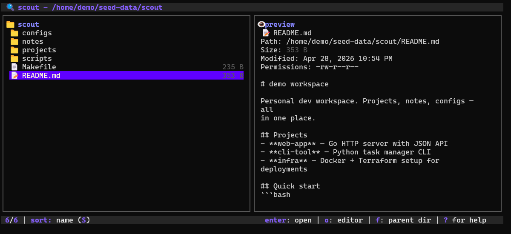

# scout

Terminal file explorer with preview, search, bookmarks, and basic file operations. `scout` is meant to stay fast and keyboard-first without giving up the everyday file actions that usually push you out of the shell.



**Live demo:** [froesch.dev](https://froesch.dev)

## Install

Supported platforms: Linux and macOS.

Windows release binaries and installer entrypoints are shipped, but native Windows support is unverified.

Recommended:

```bash
curl -fsSL https://raw.githubusercontent.com/LFroesch/scout/main/install.sh | bash
```

Windows:

```powershell
./install.ps1
```

```bat
install.cmd
```

Other options:

```bash
go install github.com/LFroesch/scout@latest
make install
```

Run:

```bash
scout
scout --version
scout --root ~/projects
```

## Features

- Vim-style navigation
- Directory and recursive search
- Content search with `rg` when available
- Search modes for current directory, recursive, content, and ultra-wide search
- File preview pane
- Bookmarks sorted by frecency
- Copy, move, rename, create, delete, and undo delete where supported
- Optional root restriction with `--root`
- Git-aware file listing with current-branch context and modified-file markers

## Shell `cd` Integration

`ctrl+g` exits `scout` and asks your shell to `cd` into the selected directory. Add this wrapper to `.zshrc` or `.bashrc`:

```zsh
function scout() {
  command scout "$@"
  local f="$HOME/.config/scout/last_dir"
  [ -f "$f" ] && cd "$(cat "$f")" && rm -f "$f"
}
```

Normal `q` or `ctrl+c` exits without changing directories.

If a file is selected, `ctrl+g` changes into that file's parent directory.

## Config

Config is stored at `~/.config/scout/scout-config.json`.

```json
{
  "skip_directories": ["node_modules", "Python*", ".cache"],
  "maxResults": 5000,
  "maxDepth": 5,
  "maxFilesScanned": 100000,
  "root_path": "",
  "bookmarks": ["/home/user/projects"],
  "show_hidden": false,
  "preview_enabled": true,
  "sort_mode": "name"
}
```

## Optional Dependencies

- `rg` enables content-search mode
- `gio` or `trash-put` enables trash-based delete with undo on Linux

Without those tools, `scout` still works; it just falls back to a simpler mode.

## Controls

| Key | Action |
|-----|--------|
| `j/k`, `up/down` | Move |
| `enter`, `l` | Open file or directory |
| `esc`, `h` | Go to parent |
| `/` | Search |
| `tab` | Cycle search mode while searching |
| `S` | Change sort |
| `.` | Toggle hidden files |
| `o` | Open selected file in editor |
| `c`, `x`, `p` | Copy, cut, paste |
| `R` | Rename |
| `N`, `M` | New file or directory |
| `b`, `B` | Browse or add bookmarks |
| `ctrl+g` | Quit and `cd` into selection |
| `?` | Help |
| `q` | Quit |

## License

[AGPL-3.0](LICENSE)
